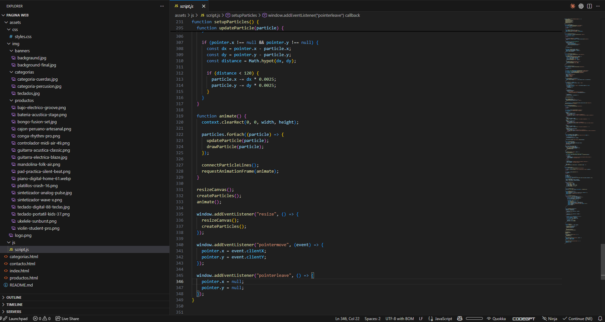
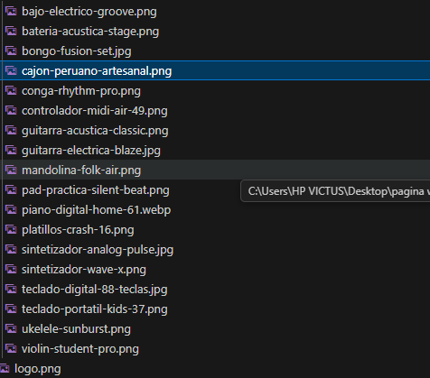
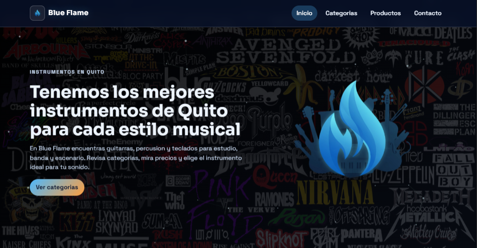
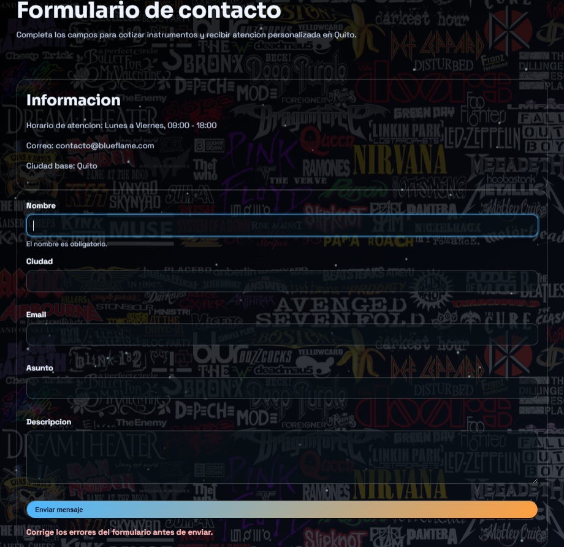

# Trabajo Final - Blue Flame

## Nombre del proyecto
**Blue Flame** - Simulacion de E-Commerce con HTML5, CSS y JavaScript

## Integrantes
-  `Pablo Puentes`
-  `Gabriel Chulde`

## Tematica elegida
**Instrumentos musicales**

## Descripcion del proyecto
Este proyecto simula una tienda en linea desarrollada con:
- HTML5 semantico
- CSS (diseno responsivo + animaciones)
- JavaScript Vanilla (DOM, eventos, validacion de formulario y filtros)

Incluye las paginas obligatorias:
- `index.html` (bienvenida)
- `categorias.html`
- `productos.html`
- `contacto.html`

Caracteristicas principales implementadas:
- Estructura semantica con `<header>`, `<nav>`, `<main>`, `<section>`, `<article>` y `<footer>`
- Diseno responsive con media queries
- Fondo animado con particulas
- Efectos interactivos al pasar el mouse sobre tarjetas y bloques
- Filtro de productos por categoria
- Validacion del formulario de contacto con mensajes dinamicos

## Capturas de pantalla
- Captura 1 - Codigo finalizado (Gabriel Chulde):

- Captura 2 - Eleccion de imagenes (Pablo Puentes):

- Captura 3 - Inicio de la pagina web:

- Captura 4 - Formulario de contacto:

## Repositorio en GitHub
https://github.com/PUCETEC-PROG2/actividad-final-integradora-pablokoh

## Sitio desplegado en GitHub Pages
https://pucetec-prog2.github.io/actividad-final-integradora-pablokoh/

## Notas
- Imagenes organizadas en:
  - `assets/img/banners/`
  - `assets/img/categorias/`
  - `assets/img/productos/`
  - `assets/img/capturas/`
- Pantalla de carga implementada con `assets/img/loader/ozzy-4.png`.

